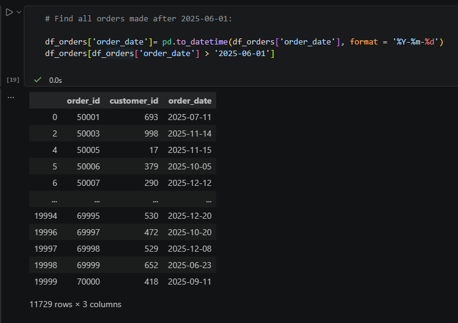
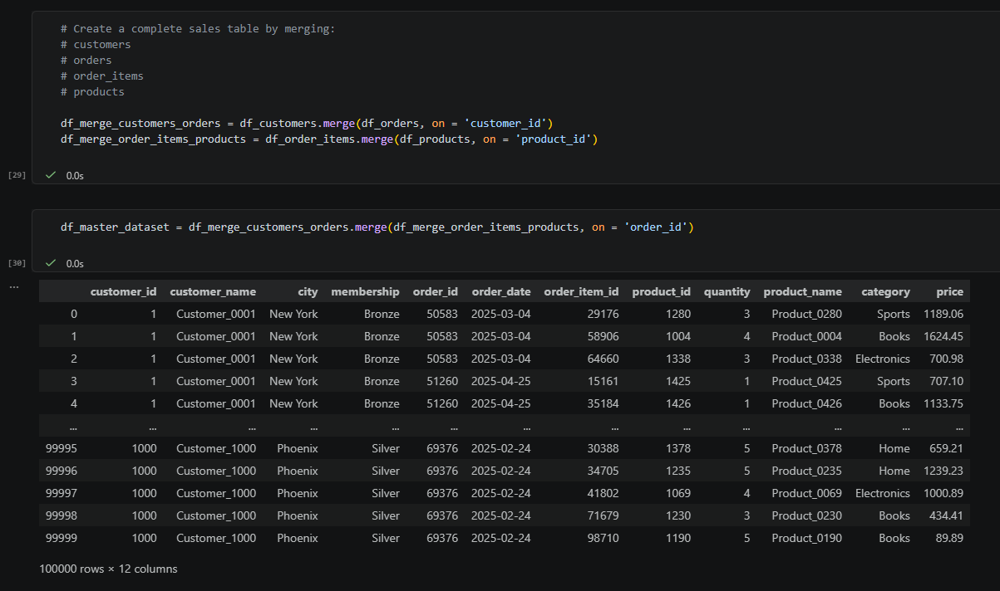
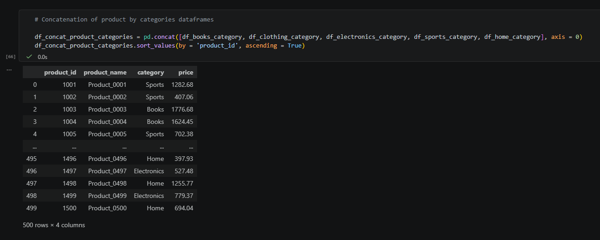
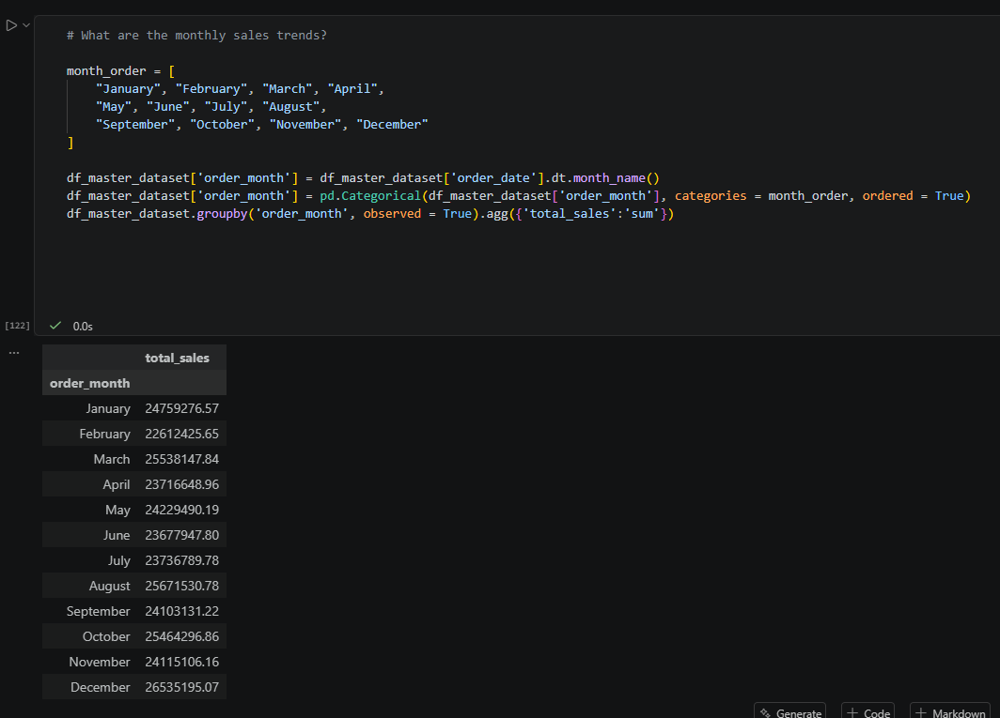

# Retail Sales Analytics with Pandas

## Project Overview

This project is a beginner-friendly data analytics project designed to demonstrate core data manipulation and analysis skills using the Python Pandas library.

The project simulates a real-world retail business environment where sales data is distributed across multiple datasets containing customer information, product details, orders, and order line items. The objective is to perform exploratory data analysis (EDA), data transformation, and business reporting by combining and analyzing data from multiple sources.

The analysis was completed entirely within a Jupyter Notebook and focuses on common tasks performed by Data Analysts, Business Analysts, and Junior Data Engineers.

## Project Objectives

The primary goals of this project are:

- Load and inspect datasets from CSV files
- Perform filtering and sorting operations
- Work with DataFrame indexing
- Aggregate data using GroupBy operations
- Combine datasets using Merge and Join operations
- Append datasets using Concatenate operations

## Dataset Information

The project uses four main datasets:

### Customers

Contains customer information including:

- Customer ID
- Customer Name
- City
- Membership Type

### Products

Contains product-related information including:

- Product ID
- Product Name
- Category
- Price

### Orders

Contains customer order records including:

- Order ID
- Customer ID
- Order Date

### Order Items

Contains transaction details including:

- Order Item ID
- Order ID
- Product ID
- Quantity

## Dataset Disclaimer

### Important Note

The datasets used in this project were artificially generated with the assistance of Artificial Intelligence (AI) for learning purposes.

These datasets do not represent real customers, real businesses, or actual commercial transactions.

The purpose of generating synthetic data was to:

- Practice data analysis techniques in a realistic business scenario
- Work with larger datasets without privacy concerns
- Simulate real-world analytical workflows

Dataset sizes:

| Dataset     | Records |
| ----------- | ------- |
| Customers   | 1,000   |
| Products    | 500     |
| Orders      | 20,000  |
| Order Items | 100,000 |

## Technologies Used

### Programming Language

- Python

### Development Environment

- Jupyter Notebook

### Libraries

- Pandas
- NumPy

## Pandas Concepts Demonstrated

This project was specifically designed to practice and demonstrate the following Pandas concepts:

### Reading Files

Loading CSV files into DataFrames using Pandas.

Examples:

Reading customer data
Reading product data
Reading order data
Reading transaction data

### Filtering Data

Filtering rows based on conditions such as:

Membership type
Product price
Order dates
Product categories

### Sorting and Ordering

Sorting data by:

Product price
Customer names
Revenue
Monthly sales

Custom ordering was also implemented for month names to ensure chronological ordering.

### Indexing

Working with DataFrame indexes to:

- Retrieve records efficiently
- Set custom indexes
- Access specific rows

### GroupBy Operations

Aggregating and summarizing data to answer business questions such as:

- Number of customers by membership level
- Product counts by category
- Average product prices
- Sales by city
- Revenue by category

### Merge Operations

Combining datasets using common keys such as:

- Customer ID
- Product ID
- Order ID

This enabled the creation of a master sales dataset for analysis.

### Join Operations

Using DataFrame indexes to combine datasets and compare join-based approaches with merge-based approaches.

### Concatenate Operations

Combining multiple DataFrames into a single dataset while validating:

- Row counts
- Data integrity

## Business Questions Answered

The project answers several common business questions including:

### Customer Analysis

- How many customers belong to each membership tier?
- Which customers spend the most?
- Which cities have the highest number of customers?

### Product Analysis

- Which products generate the highest sales?
- Which categories contain the most products?
- What is the average product price by category?

### Sales Analysis

- What is the total revenue generated?
- Which category generates the highest revenue?
- Which city generates the highest revenue?
- What are the monthly sales trends?
- What is the average order value?

## Sample Outputs

### Orders made after a specific date



### Merging dataframes



### Concatenate dataframes



### Handling dataframes with date values



## Project structure

```
retail-sales-analytics/
│
├── data/
│   ├── customers_part1.csv
│   ├── customers_part2.csv
│   ├── customers.csv
│   ├── order_items.csv
│   ├── orders.csv
│   └── products.csv
│
├── notebooks/
│   └── retail_sales_analytics.ipynb
│
├── screenshots/
│   ├── concatenate_dataframes.png
│   ├── merge_dataframes.png
│   ├── monthly_sales.png
│   └── orders_made_after_date.png
│
└── README.md
```

## Key Learning Outcomes

Through this project, I gained hands-on experience with:

- Data loading and inspection
- Data cleaning and validation
- Data transformation
- Aggregation and summarization
- Relational data analysis
- Working with larger datasets using Pandas
- Building reproducible analytics workflows in Jupyter Notebook
